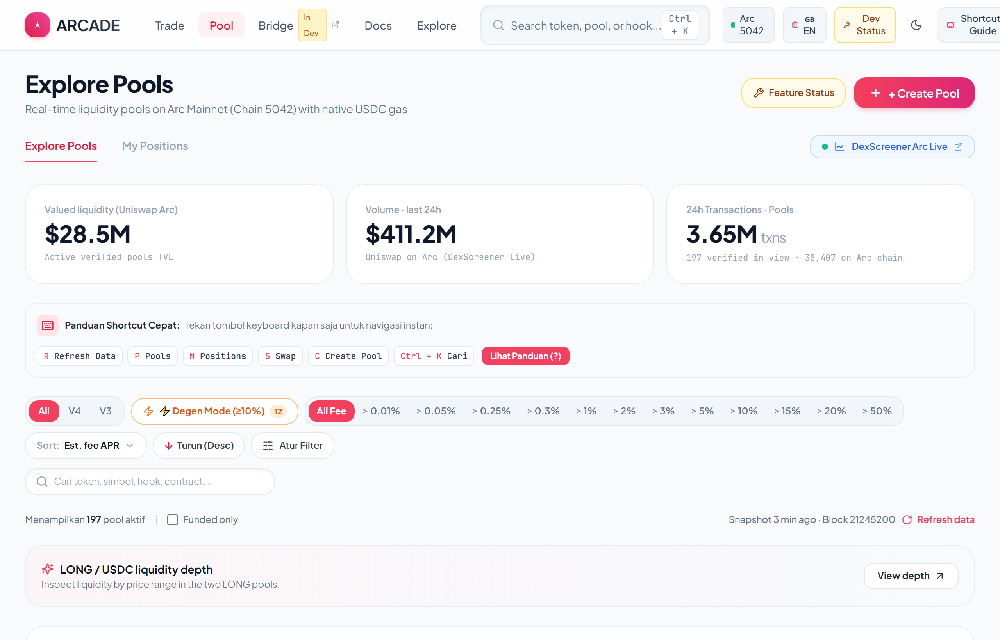
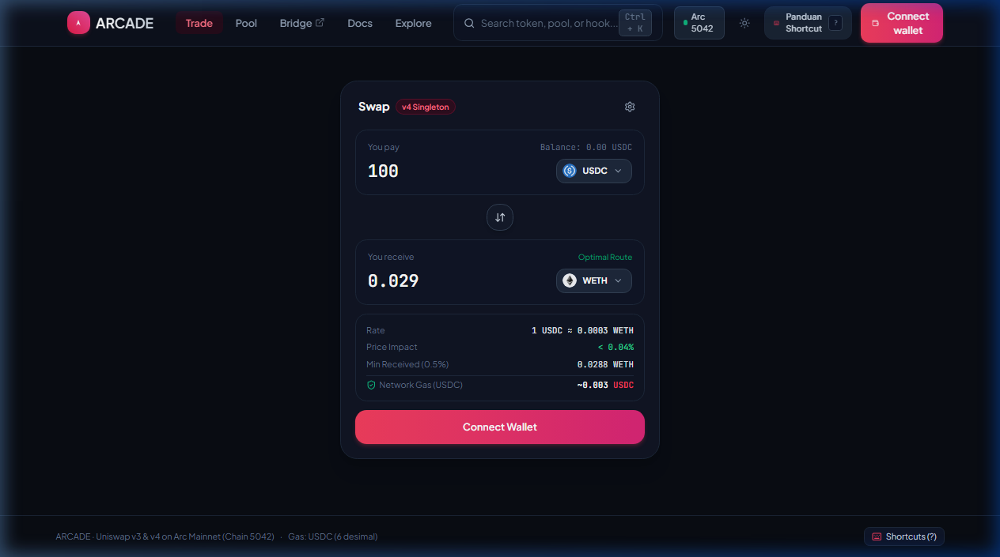
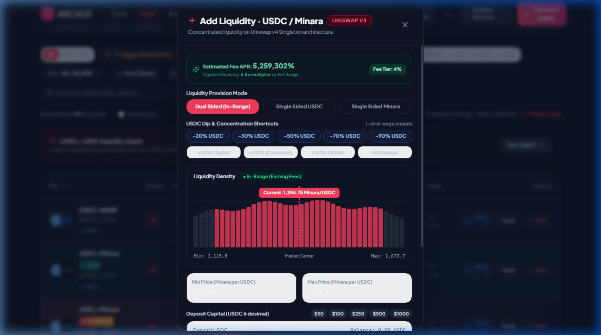
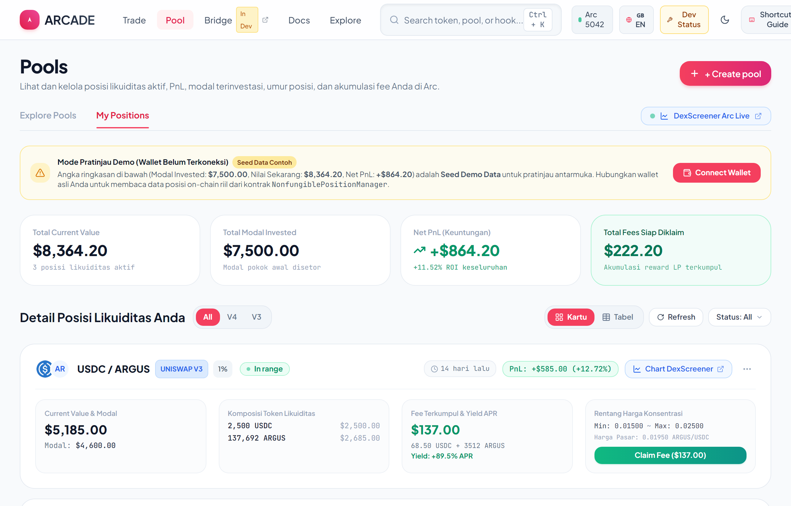
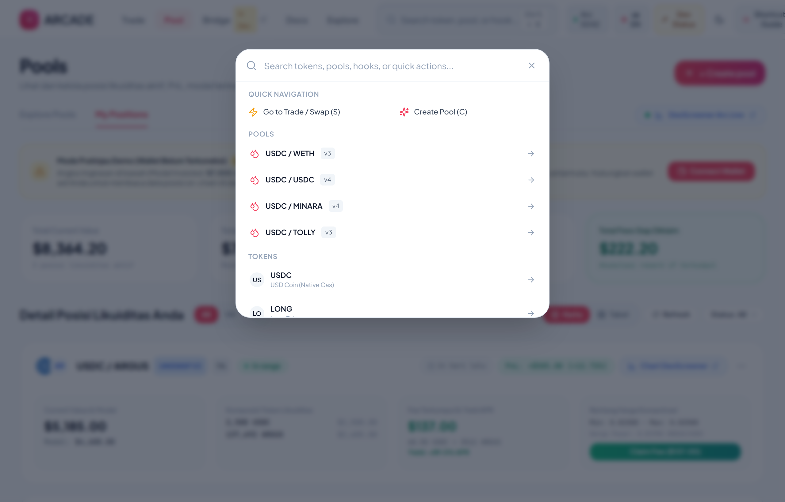
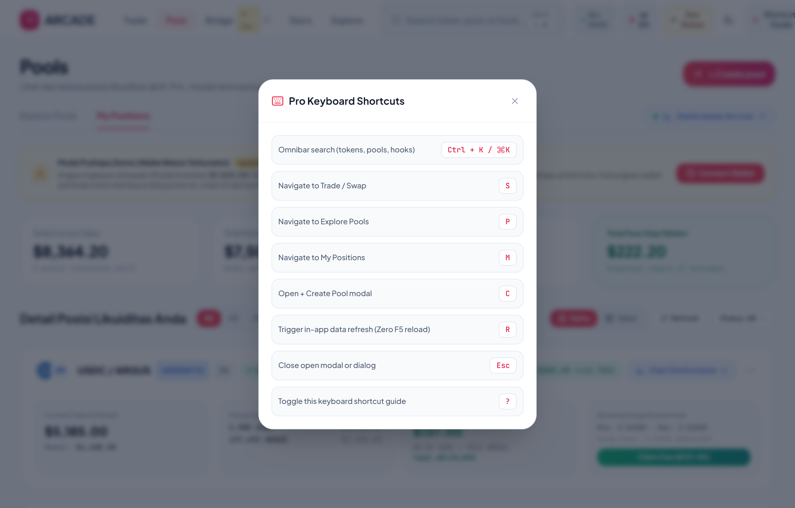
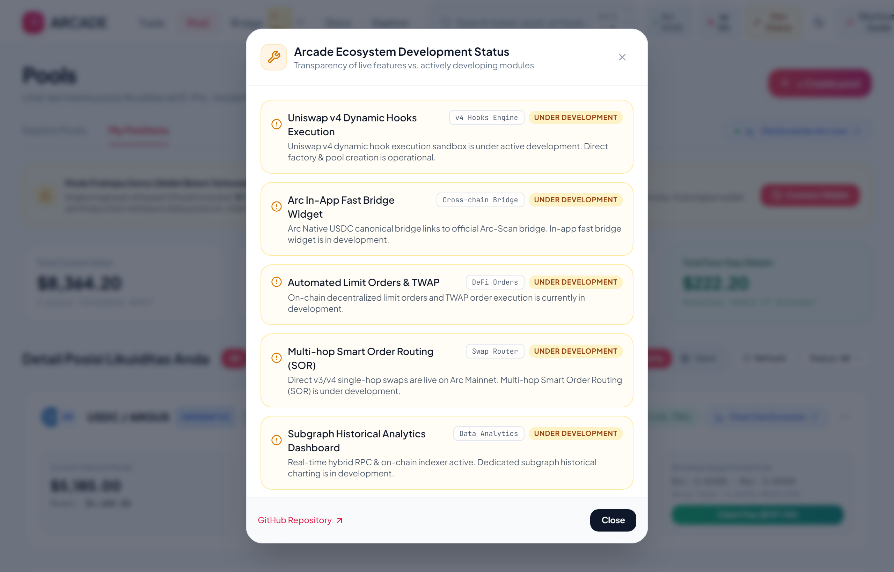

# 🦄 Arcade · Antarmuka Uniswap v3 & v4 di Arc Mainnet (Chain 5042)

<div align="center">

[](https://vitejs.dev/)
[](https://reactjs.org/)
[](https://www.typescriptlang.org/)
[](https://tailwindcss.com/)
[](https://arc-scan.org)
[-2775CA?style=for-the-badge&logo=usd-coin&logoColor=white)](https://www.circle.com/usdc)

**Antarmuka Decentralized Exchange (DEX) responsif dan berkinerja tinggi yang dirancang khusus untuk Uniswap v3 & v4 pada jaringan Arc Mainnet (Circle L1).**

[English](README.md) · [Bahasa Indonesia](README_ID.md)

</div>

---

## 📖 Ringkasan Proyek

**Arcade** adalah antarmuka modern Uniswap v3 & v4 yang dirancang khusus untuk **Arc Mainnet (Chain ID: `5042`)**. Berbeda dengan rantai EVM pada umumnya yang menggunakan token gas native bernilai 18 desimal (seperti ETH), Arc Mainnet menggunakan **USDC dengan 6 desimal** sebagai mata uang gas native.

Aplikasi ini menyuguhkan pengalaman DeFi tingkat lanjut: eksplorasi likuiditas real-time, penyediaan likuiditas terkonsentrasi (*concentrated liquidity*), penukaran token instan (*swap*), manajemen siklus posisi LP lengkap, pencarian global (*Omni-Search*), dan tombol pintasan keyboard (*pro shortcuts*).

---

## 📸 Panduan Visual & Tangkapan Layar (Screenshots)

### 1. Halaman Eksplorasi Pool (Explore Pools)
*Melihat seluruh pool likuiditas Uniswap v3 & v4 secara real-time lengkap dengan TVL, Volume 24 Jam, estimasi APR, dan tingkatan fee.*


---

### 2. Mesin Penukaran Token (Swap Interface)
*Penukaran instan antar-token dengan kalkulasi slippage otomatis, estimasi biaya rute, dan fitur pembalik arah pasangan token.*


---

### 3. Modal Tambah Likuiditas Terkonsentrasi (Uniswap v3 Range Picker)
*Pengaturan rentang harga batas bawah (*Min Price*) dan batas atas (*Max Price*), toggle Full Range, serta pilihan preset fee tier 0.01% - 1.00%.*


---

### 4. Dasbor Posisi Likuiditas (My Positions)
*Memantau posisi likuiditas aktif berbasis NFT, akumulasi pendapatan fee yang belum diklaim, dan panen fee 1-klik.*


---

### 5. Pencarian Pintar Global (Omni-Search `/`)
*Navigasi kilat untuk mencari pool, ticker token, alamat kontrak, atau berpindah tampilan antar tab.*


---

### 6. Modal Pintasan Keyboard (`?`)
*Daftar lengkap tombol pintasan keyboard untuk pengguna pro agar navigasi berjalan tanpa mouse.*


---

### 7. Modal Status Fitur & Roadmap Pengembangan
*Dasbor transparansi ekosistem yang menampilkan fitur siap pakai di mainnet vs modul yang sedang dalam pengembangan aktif.*


---

## 🚧 Status Fitur: Siap Pakai vs. Dalam Pengembangan

Untuk transparansi penuh bagi para trader dan penyedia likuiditas (LP) di jaringan Arc Mainnet, Arcade membagi status fitur ke dalam dua kategori:

| Fitur / Modul | Status | Keterangan |
| :--- | :---: | :--- |
| **Swap Token Langsung v3 & v4** | 🟢 **Aktif di Mainnet** | Swap token dengan gas native USDC (6 desimal) pada pool single-hop terverifikasi dengan proteksi slippage. |
| **Likuiditas Terkonsentrasi (v3)** | 🟢 **Aktif di Mainnet** | Rentang harga kustom, Full Range, preset batas tick, klaim bagi hasil fee, dan manajemen posisi NFT. |
| **Penjelajah Pool Real-Time** | 🟢 **Aktif di Mainnet** | Eksplorasi real-time 197+ pool Arc dengan TVL, volume 24j, APR, dan pelacak fee Degen. |
| **Dukungan Bilingual (EN & ID)** | 🟢 **Aktif di Mainnet** | Penggantian bahasa Bahasa Indonesia dan English langsung melalui tombol di navbar aplikasi web. |
| **Pencarian Omni-Search & Hotkeys** | 🟢 **Aktif di Mainnet** | Pencarian instan `/` (Ctrl+K) dan tombol pintasan keyboard kilat (`S`, `P`, `M`, `C`, `R`, `?`, `Esc`). |
| **Mode Terang (Light) & Gelap (Dark)**| 🟢 **Aktif di Mainnet** | Tampilan Light mode dan Dark mode premium dengan penyimpanan preferensi otomatis di LocalStorage (semua tangkapan layar menggunakan mode Light). |
| **Dynamic Hooks Uniswap v4** | 🟡 **Dalam Pengembangan** | Pembuatan pool dengan flag hook telah aktif; sandbox eksekusi kontrak custom hook sedang dikembangkan. |
| **Widget Fast Bridge Bawaan** | 🟡 **Dalam Pengembangan** | Saat ini mengarah ke bridge resmi Arc-Scan; widget fast-bridge bawaan di dalam dApp sedang dikembangkan. |
| **Limit Orders & TWAP Otomatis** | 🟡 **Dalam Pengembangan** | Limit order dan pesanan TWAP terdesentralisasi on-chain pada pool Uniswap v3/v4. |
| **Multi-Hop Smart Order Routing** | 🟡 **Dalam Pengembangan** | Rute single-hop langsung telah beroperasi; pembagian rute multi-hop otomatis lintas 3+ token sedang dioptimalkan. |
| **Dashboard Historis Subgraph** | 🟡 **Dalam Pengembangan** | Grafik candlestick mendalam dan analitik likuiditas historis berbasis subgraph. |

---

## ✨ Fitur-Fitur Unggulan

1. **Dukungan Ganda Uniswap v3 & v4**:
   - Menampilkan dan mengelola pool Uniswap v3 serta pool arsitektur baru Uniswap v4 (Singleton PoolManager).
2. **Dukungan Bahasa Ganda (Bilingual EN / ID)**:
   - Pengguna dapat beralih antara Bahasa Indonesia dan English dengan 1-klik di bagian atas navigation bar.
3. **Kompabilitas Penuh Gas Native USDC Arc (6 Desimal)**:
   - Menghindari masalah overflow atau desimal salah akibat asumsi 18 desimal standar Ethereum.
4. **Penyedia Likuiditas Terkonsentrasi (Concentrated Liquidity)**:
   - Slider tick batas harga otomatis yang mengkalkulasikan rasio deposit token A dan token B.
   - Preset rentang cepat: **Full Range**, **±5%**, **±10%**, **±20%**.
   - Pilihan fee tier: `0.01%` (Stablecoin), `0.05%` (Pasangan umum), `0.30%` (Volatilitas sedang), `1.00%` (Eksotis).
5. **Manajemen Siklus Posisi LP**:
   - **Tambah Likuiditas**: Suntik modal baru ke pool yang sudah ada.
   - **Tarik Sebagian Likuiditas**: Slider persentase penarikan (`25%`, `50%`, `75%`, `100%`).
   - **Klaim Fee Tanpa Exit**: Ambil hasil fee perdagangan tanpa harus menutup posisi likuiditas aktif.
6. **Data Snapshot Terverifikasi On-Chain**:
   - Disertai file `public/arc_real_pools.json` berisi puluhan pool resmi yang telah diverifikasi di Arc Mainnet.
7. **Omni-Search (`/`) & Pro Shortcuts**:
   - Navigasi super cepat dengan tombol keyboard standar trader pro.
8. **Mode Gelap & Terang (Dark / Light Mode)**:
   - Desain modern bernuansa web3 dengan penyimpanan preferensi otomatis di LocalStorage (semua tangkapan layar diperbarui dalam Mode Terang / Light Mode).

---

## 🌐 Detail Jaringan & Alamat Kontrak Arc Mainnet

| Parameter | Nilai Konfigurasi |
| :--- | :--- |
| **Nama Jaringan** | Arc Mainnet (Circle L1) |
| **Chain ID** | `5042` (`0x13b2`) |
| **Token Gas Native** | **USDC** (6 Desimal) |
| **RPC Endpoint** | `https://rpc.mainnet.arc.io` |
| **Block Explorer** | [https://arc-scan.org](https://arc-scan.org) / [https://explorer.arc.io](https://explorer.arc.io) |

### Kontrak Resmi Uniswap di Arc Mainnet

| Kontrak | Alamat Kontrak (Contract Address) |
| :--- | :--- |
| **V4 PoolManager** | `0x8366a39CC670B4001A1121B8F6A443A643e40951` |
| **V4 PositionManager** | `0x6049c9a0e26405C0985f9E3685C87d0aE917f82B` |
| **V4 PositionDescriptor** | `0x516b8a945700D6bBfDeDaa6dcFc4586bA60B8707` |
| **V4 Quoter** | `0x8Dc178eFB8111BB0973Dd9d722ebeFF267c98F94` |
| **V4 StateView** | `0xF3334192D15450CdD385c8B70e03f9A6bD9E673b` |
| **V3 Factory** | `0xf0db7b58379503491d857dB50AC9ece64c653918` |
| **V3 NonfungiblePositionManager** | `0x39654A85A4C05127f5Fd6ED22CAeC077A0fB1377` |
| **V3 QuoterV2** | `0x7DfD4F31be6814D2906BDE155c3e1B146EAc1468` |
| **V3 SwapRouter02** | `0x53BF6B0684Ec7eF91e1387Da3D1a1769bC5A6F77` |
| **UniversalRouter** | `0x4fcA4a51Ab4F23A7447b3284fBd7D73289A89Fb1` |
| **Permit2** | `0x000000000022D473030F116dDEE9F6B43aC78BA3` |

---

## ⌨️ Daftar Pintasan Keyboard (Shortcuts)

| Tombol | Fungsi |
| :---: | :--- |
| `/` | Buka kotak pencarian global (Omni-Search) |
| `S` | Pindah ke tab Swap (Tukar Token) |
| `P` | Pindah ke tab Explore Pools (Jelajahi Pool) |
| `L` | Pindah ke tab My Positions (Posisi Likuiditas Saya) |
| `N` | Buka modal Buat Pool Baru (Create Pool) |
| `R` | Muat ulang (refresh) data pool & posisi seketika |
| `?` | Tampilkan bantuan pintasan keyboard |
| `Esc` | Tutup semua modal atau jendela pop-up |

---

## 🚀 Panduan Instalasi & Menjalankan Aplikasi

### Persyaratan Sistem
- [Node.js](https://nodejs.org/) versi 18.0 atau lebih baru
- npm / yarn / pnpm
- Web3 Wallet (MetaMask, Rabby Wallet, dll.) yang terhubung ke jaringan Arc Mainnet (Chain 5042)

### 1. Kloning Repositori & Install Dependencies
```bash
git clone https://github.com/your-username/arcade-uniswap-arc.git
cd arcade-uniswap-arc
npm install
```

### 2. Konfigurasi Environment (Opsional)
Jika ingin menggunakan RPC kustom atau mengubah alamat kontrak:
```bash
cp .env.example .env
```

### 3. Jalankan Server Pengembangan (Development)
```bash
npm run dev
```
Buka browser di [http://localhost:5173](http://localhost:5173).

### 4. Build untuk Produksi
```bash
npm run build
npm run preview
```

### 5. Script Sinkronisasi Data Pool
Untuk memperbarui daftar pool secara langsung dari RPC Arc & Gateway Uniswap:
```bash
npm run fetch:pools
```
Untuk memverifikasi ketersediaan bytecode kontrak di Arc Mainnet:
```bash
npm run verify:factories
```

---

## 📁 Struktur Direktori Proyek

```
arcade-uniswap-arc/
├── docs/
│   └── images/                 # Gambar tangkapan layar UI untuk dokumentasi GitHub
├── public/
│   └── arc_real_pools.json     # Data pool asli Arc Mainnet (TVL, volume, APR)
├── scripts/
│   ├── fetch_real_arc_pools.js # Pengambil data pool via GraphQL & RPC
│   ├── verify_factories.js     # Skrip verifikasi bytecode kontrak on-chain
│   └── README.md               # Dokumentasi skrip pembantu
├── src/
│   ├── components/             # Komponen antarmuka (Navbar, Swap, Pools, Positions, Modals)
│   ├── config/                 # Konfigurasi chain, token, dan kontrak Arc Mainnet
│   ├── hooks/                  # Custom hook React (useArcData, useShortcuts)
│   ├── services/               # Layanan indexing pool dan posisi
│   ├── types/                  # Definisi tipe TypeScript
│   ├── utils/                  # Utilitas kalkulasi matematika tick dan format mata uang
│   ├── App.tsx                 # Komponen utama aplikasi
│   ├── index.css               # Gaya CSS Tailwind
│   └── main.tsx                # Titik masuk aplikasi
├── package.json
└── vite.config.ts
```

---

## ☕ Dukung Proyek Ini (Support & Donasi)

Jika antarmuka ini membantu Anda menghemat waktu, mengelola likuiditas terkonsentrasi, atau memantau pool di Arc Mainnet dengan lebih baik, Anda dapat mendukung pengembangan dan pemeliharaan fitur selanjutnya:

| Jaringan / Chain | Aset yang Didukung | Alamat Wallet (Klik untuk Salin) |
| :--- | :--- | :--- |
| **Bitcoin (BTC)** | Native BTC | `bc1qulgaaddxhl9qz5jcs4wu5tx5j3g9ng3lfd4cl0` |
| **Jaringan EVM** | **Arc Mainnet (Gas USDC)**, ETH, Base, Arbitrum, BSC, Polygon | `0xFCDD187D32cFaecD8B07638BD6004fA2bF6838C6` |
| **Solana (SOL)** | SOL, Token SPL (USDC, USDT, dll.) | `2zyBHgVYNp5WnKUK25WsdsQbsMzkj8Kzw2wDePWAnGZY` |
| **Sui Network** | SUI, Token Ekosistem Sui | `0xfac84087048bf82f4f99c7704ee0cf9b1386c064b8ea845ab6baf65d1153eb09` |

> [!TIP]
> **Multi-Chain EVM**: Alamat EVM di atas mendukung penerimaan di **Arc Mainnet (Chain 5042)**, Ethereum, Arbitrum, Optimism, Base, Polygon, dan BNB Chain.

---

## 📄 Lisensi

Proyek ini bersifat open-source di bawah lisensi [MIT License](LICENSE).
